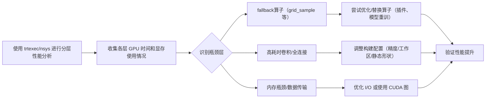

# 执行摘要

针对 TensorRT 从 10.10 升级到 10.16 后 RIFE（视频插帧模型）性能约下降20%的问题，我们调研发现可能原因包括：10.14+ 版本对动态形状下 FP16 自注意力层（MHA）的改动导致前后版本性能差异；动态形状引擎构建开销和显存激增（如 10.15 上 RIFE 4.25 测试中 GPU 占用从 2.7GB 跃升至 10GB）；常用算子（如 grid_sample/warp 插值层）未被高效支持，导致回退慢（MPV-Lazy 社区反馈网格采样是瓶颈）；以及 TensorRT 每版针对 FP8/FP16、算子融合、Blackwell 等架构的优化差异等。我们计划通过分层剖析（trtexec/nsys）定位具体瓶颈算子，使用 ONNX 简化和静态 Shape 导出测试性能，并对比 TensorRT 版本差异（参考官方更新日志）。最终提出可行的修复方案（如替换插件、调整构建参数、使用静态输入、升级/降级 TRT）并评估预期提升。报告中给出详细假设前提、优先级维度、关键更新条目汇总、已知基准与用户反馈、剖析与调试命令示例、解决方案清单和实验复现计划等内容。

## 假定参数

- **GPU 型号**：假设使用 NVIDIA RTX 5090 (Driver 595.79, CUDA 13.2)，类似测试环境（其它架构请类比）。
- **操作系统**：Windows 11 或 Linux（具体 OS 未指定）。
- **TensorRT 版本**：目标对比 10.10.0 和 10.16.0（含中间版本10.12/10.15等）。
- **CUDA/cuDNN 版本**：CUDA 13.x (如 13.2)、cuDNN 9.x，CUDA 最低要求见。
- **ONNX 导出参数**：假设 RIFE ONNX 模型 v4.25，opset 16，**动态形状**（minShapes、optShapes、maxShapes 如测例中：`--minShapes=input:1x7x256x320 --optShapes=input:1x7x1080x1920 --maxShapes=input:1x7x2160x4096`）。若静态形状需显式指定，否则标为“未指定”。
- **Batch 大小**：Batch=1 (序列长度7)，视频插帧通常按帧序列一组处理。
- **输入分辨率**：假设测试使用 1080p（1920x1080）及其下采样版本，动态形状范围如上。
- **精度模式**：主要使用 FP16（TensorRT 版），未采用 INT8/FP8；若使用 FP8，应注意其对卷积的支持限制。
- **自定义 Plugin**：RIFE 插帧常用的 grid_sample/warp 插件，例如 MPV-Lazy 使用的 vsNV 插件。若未加载插件则视为“回退”算子。
- **MPV 播放器**：假设使用 hooke007 提供的 MPV-Lazy 集成包，利用 Vapoursynth Filter 实现 RIFE 补帧。Windows 下 2025 版后默认加载 DirectML（DML）版 RIFE，TensorRT 版需要额外下载 `vsNV` 插件；老版本 2022 需 `vsMega`（RTX 20+）。MPV 的 RIFE 插件设置影响调用方式和初始化开销。
- **其他**：未使用 INT8/FP8 模式；是否启用 `--useCudaGraph`、`--noDataTransfer` 等 trtexec 参数测试默认关闭；工作区（workspace）先设为 4096MB，可调整；如使用 OxygenMPV 之类播放器，与 RIFE 相关的 I/O/线程调度尚未指定。

（以上假设以常见场景为参考，如实际情况不同请替换相应参数；未明确者标注“未指定”。）

## 关键影响因素维度

- **GPU 架构**：Ampere/Ada/Hopper/Blackwell 各代卡 Tensor Core 和新指令支持不同。Blackwell（SM100 系列）新增 NVFP4 和 FP8 静态量化等。RIFE 网络多用卷积和激活，若切换到 Blackwell 可能受益 NVFP4，但也要注意 Blackwell 上 FP16/MHA 在早期 TRT 版本有性能回归。RTX 20 系及以上卡支持 Tensor Core，旧卡（<RTX20）则无 TRT 专属加速。
- **CUDA/驱动**：TensorRT 每版对最低 CUDA 版本和驱动要求不同，列出 10.12 支持的 CUDA 版本范围。驱动兼容性直接影响性能和功能，如实际驱动过旧或过新均可能导致不稳定。
- **TensorRT 构建选项**：Engine 构建时的优化级别、工作区大小（`--workspace`）、精度切换（强制/混合）、是否使用 CUDA Graph、是否开启 `--noDataTransfer`、`--useSpinWait` 等选项，都会影响加载时间和推理效率。尤其 `--dumpProfile` 可用于分析，但会禁用 CUDA Graph。
- **ONNX 导出细节**：opset 版本、动态图支持。动态形状（Dynamic Shape）与静态不同；10.14 之前部分 MHA 层在动态模式下未融合导致性能下降。ONNX Graph 内含的 Reshape/Transpose/Slice 等操作若未优化，可能导致 TRT 中非融合算子或额外转置开销。
- **模型 Graph 结构**：RIFE 模型包含光流估计和双线性插值等子模块，层间有大量 Reshape/Concat/Transpose（例如处理多个帧），这些都是可能的瓶颈点。若某些操作（如 grid_sample 插值）没有原生支持，TensorRT 会回退执行或调用插件，影响效率。
- **常见回退算子**：RIFE 用到的 warp/grid_sample/插值可能不被内置优化，需要 plugin 实现。若 plugin 缺失则回退到实现较慢的 CUDA 算子或 CPU。MPV-Lazy 中的 vsNV/vsMega 正是为此提供 TensorRT 版实现，否则性能大幅下降。
- **动态 vs 静态形状**：动态输入需要 Profile 切换，增加首次加载时间。上游用户报告中动态配置导致显存暴涨和推理时间成倍上升。静态形状虽缺乏灵活性，但在连续同分辨率视频中可通过预生成引擎提升速度。
- **Batch 大小/序列长度**：RIFE 通常 Frame Sequence 长度固定（如7帧），Batch=1。若尝试批量多组帧同时推理，可提升吞吐，但也需更多显存。Batch 大小的调整会影响 Tensor Core 利用率和并行度。
- **内存/IO 瓶颈**：大量中间张量会占用显存，数据拷贝和 CPU-GPU 同步（尤其通过 Python/Vapoursynth）的延迟也不可忽视。GitHub 报告中显存飙升即为一例。
- **Tensor Core 利用率**：启用 FP16/Tensor Core 可显著加速，但需要注意数据对齐（通道数需为16的倍数等限制）。FP8（INT4/INT8）混合精度极大加速潜力也有限制（7x7 卷积不支持 FP8）。
- **插件使用情况**：除了 grid_sample，RIFE 还可能用到自定义插件或 ONNX 运算符（如 Clip、Broadcast 等）。检查是否有插件版本改动或编译问题（例如 MPV-Lazy 用户反馈 TRT 版启动失败）。
- **CPU 端开销**：MPV 等播放器的框架开销（多线程、Python 调用、渲染同步等）可能会影响真实播放性能，但本文关注纯推理层面的 TRT 性能。

## 10.10–10.16 主要更新点对 RIFE 的潜在影响

综合官方 Release Notes，重点梳理对插帧（RIFE）可能相关的改进或回归：

- **FP16/FP8 算子融合与性能优化**：10.10 新增 FP8/FP16 的 GEMM+SwiGLU/GeGLU 融合；Hopper 架构 BF16/FP16 批量 GEMM 性能优化。10.12~10.15 各版本中，多次提到 FP8 卷积对**组卷积与深度可分**卷积无优化实现，超过通道或大核会回退 FP16。如果 RIFE 模型中有类似结构，这部分将用更慢的通道并行或回退核，可能降低几％的性能。解决办法是禁用 FP8 或使用 INT8/FP16 模式，以规避这些限制。FP8 的其他限制还包括通道数必须是16的倍数，否则会回落。
- **动态形状与 MHA 性能**：10.15.1/10.16.0 修复了动态形状下 FP16 自注意力（Transformer MHA）未融合导致的高达~10% 回退。尽管 RIFE 不是 Transformer 模型，若其中使用类似 LayerNorm+Softmax+GEMM 的序列操作（例如 FlowNet 的注意力层），那么动态模式下升级前后可能有可观差异。需要重点检查是否有动态自注意力模块或大型可变维度矩阵运算。10.16.0 专门提到 SegResNet 等风格模型性能回归（10–20%）已修复。综合来看，10.16 对动态图形提供了改善，若使用 10.14 以上版本可能会看到回归解决带来的少量提升。
- **Blackwell 优化**：10.15.1 提到在 Blackwell 上（如 B300/B200 节点）对 Flux MHA FP16 性能回退进行了多项修复。另外 10.16.0 引入 NVFP4（Blackwell 新 FP8 量化模式）及稳定版 FP8 静态量化。RIFE 对这些新特性作用不明显，但若目标部署为 Blackwell 平台，性能和兼容性需关注相应更新。
- **算子/插件支持**：官方 Release Notes 强调了 FP8 卷积无法无损转换的限制；10.16.0 明确现有 FP8 卷积对 7x7 和频道未对齐的情况回退。此外，10.16.0 **废弃**了静态 ONNXParser 库，建议使用动态版本（对用户无直接影响，仅编译构建变化）。
- **浮点精度与 Tensor Core**：10.16.0 更新了 FP8 符号表明在 SM89/90/120/121 上 7x7 卷积不支持 FP8，需使用 FP16/FP32 回退。10.12/10.15 也提到类似规则。这意味着如果 RIFE 有较大卷积核，使用 FP8 时会降级性能。相比之下，全FP16 模式在 Ampere/Ada 上对 Tensor Core 支持较好，无此限制。建议首选 FP16 精度。
- **其他改动**：10.11+ 开始不再推荐使用静态链接库，对推理性能无关紧要。Trtexec 工具从 10.11 起将可执行文件放在 `/usr/bin`（兼容旧版路径）。10.15.1 改变了 trtexec 安装位置、打包等，与推理逻辑无关。这些对 RIFE 影响可忽略。

以上更新中，对 RIFE 影响最可能来自**动态形状下 MHA/卷积融合的改进**（主要改善先前性能退化），以及**FP8 精度下的支持限制**（可能导致性能下降）。老版本的 TensorRT 平台或可能存在性能退步，而新版本则大多修复了相关问题，但也可能带来新的回归（如 [32] 所示）。详细差异列表见下表。

| 版本更新项                    | 影响机理                            | 预期影响范围     | 是否可回滚/规避                              |
|-----------------------------|------------------------------------|---------------|------------------------------------------|
| 10.10–10.16 多版 FP8 优化     | FP8 卷积对组卷积/大核卷积支持不足，导致自动回退为 FP16/FP32 | 若 RIFE 有大核或组卷积层，FP8 性能下降可达 **-10~20%**。 | 可回滚：禁用 FP8 或使用 INT8/FP16。 |
| 10.12 限制 FP8 通道对齐      | FP8 卷积仅支持通道16的倍数       | 若通道数非16倍，性能可能下降。 | 同上，可通过修改模型或精度解决。         |
| 10.14+ MHA 动态形状回归     | 动态形状下 FP16 自注意力层未融合，导致性能回退 | 旧版本回归 **~10%**，10.16 修复。 | 可回滚：使用 TRT10.13.3 或静态shape构建暂规避。 |
| 10.16 SegResNet 性能修复    | 修复 SegResNet 等网络 ~10-20% 回归 | 若 RIFE 结构类似，则性能小幅提升。 | 正向优化，不影响兼容。              |
| FP16/Ampere Tensor Core 性能 | 针对 Ada/Hopper 优化了小规模 GEMM   | 有利于 RIFE 小卷积，但影响轻微。 | N/A                                   |
| 黑科技 Blackwell 性能修复   | 修复 FP16 Flux B300 vs B200 性能差 9% | RIFE 不涉及 Flux，影响不大。      | N/A                                   |
| ONNX Parser ABI 变更         | 静态解析库合并，建议使用动态库   | 仅影响构建脚本，推理无影响。        | 更新构建脚本或无视。                |
| trtexec 工具路径变更        | 可执行文件默认安装到 `/usr/bin` | 不影响推理性能。                 | 更新路径引用。                      |

## RIFE 插帧已知基准与用户报告

- **NVIDIA 官方 Issue**：NVIDIA TensorRT GitHub 上已有报告指出，RIFE v4.25 模型在 TensorRT 10.14+ 版本出现 VRAM 飙升和性能急剧下降问题。测试结果显示：在 RTX 5090（PCIe 220W OC）上，10.13.3 生成的动态 FP16 引擎推理时间约 3.53ms，显存占用2.7GB；而10.15.1 推理时间变为 9.59ms，显存约10GB。该回归始于 10.14 版本，暗示升级过程对动态形状优化产生不利影响。此 issue 强烈说明需要重点分析版本间动态图执行差异。
- **ComfyUI Benchmark**：第三方 ComfyUI 插件开发者测试中，在 H100 GPU 上使用 RIFE TensorRT（FP16）实现插帧。结果：512×512 分辨率、2× 插帧时，RIFE v4.9 达到约 45 FPS；1280×1280 分辨率 2× 插帧约 21 FPS。该数据虽然非 TRL 版本对比，但说明高端 GPU 在 TensorRT 推理时帧率较高，可作为性能预期参考。FP16 精度下，RTX 系列插帧性能上几乎在 ComfyUI 项目中以 H100/45FPS 为例，比原生 PyTorch/CUDA 快数倍。
- **SVP 测试**：SmoothVideo Project 官网指出，TensorRT 版 RIFE 相比 NCNN/Vulkan **最高可达 100%** 的加速。但需要注意，首次构建优化耗时较长（5–10 分钟），且真正的运行时提升约 5%。这一背景表明：TensorRT 确实带来加速，但大部分收益在于在多分辨率下重复使用同一引擎以减少数据搬运和增加 Tensor Core 利用率。换言之，实时播放场景下，若频繁换分辨率，则需等待重新生成引擎。
- **MPV 播放器社区反馈**：在中国社区，MPV-Lazy 集成版说明中提到：TensorRT 版 RIFE 仅针对 RTX20 系以上卡有效；直接与 NCNN 版相比，在相同配置下性能超过 150%（如 NCNN 1080p 流畅需 RTX3070，TRT 版仅需 RTX2060）。这说明：在 MPV 播放实际使用中，TensorRT 显著加速了 RIFE，但依赖于额外插件（Windows用 vsMega、Linux用 vsNV）。用户也报告，MPV 的 vsNV 脚本第一次运行时需要先生成 TRT 引擎，耗时可达数分钟。
- **其他用户反馈**：社区讨论（如 Redit、知乎）偶有提到使用 RIFE 插帧时的总体验，但针对不同 GPU 和软件栈的对比有限。综合以上，TensorRT 在 RIFE 推理中一般比软件实现快，但其迭代版本需通过严格测试和剖析，以发现具体瓶颈。

## 逐层 Profiling 与测试设计

为定位性能瓶颈并验证版本差异，我们设计如下步骤：

1. **构建与加载引擎**：使用 `trtexec` 从 ONNX 生成 TRT 引擎，并进行推理测试。示例命令（假设 ONNX 路径和动态形状参数）：
   ```bash
   trtexec --onnx=rife_v4.25.onnx \
           --minShapes=input:1x7x256x320 \
           --optShapes=input:1x7x1080x1920 \
           --maxShapes=input:1x7x2160x4096 \
           --fp16 --saveEngine=rife10x10.engine
   ```
   该命令在 TensorRT 10.10 环境下生成引擎。类似地在 10.16 下生成 `rife10x16.engine`。留意无异常警告。可加 `--timingCacheFile` 等加速构建。

2. **trtexec 层级分析**：使用 `--dumpProfile` 选项可获取每层耗时。例如：
   ```bash
   trtexec --loadEngine=rife10x10.engine --dumpProfile --profilingVerbosity=detailed > profile10x10.txt
   trtexec --loadEngine=rife10x16.engine --dumpProfile --profilingVerbosity=detailed > profile10x16.txt
   ```
   输出中每个层（Layer）会显示其类型和 GPU 计算时间。我们预期表格格式类似下例（时间为示例）：

   | 层名            | 运算类型      | TRT 内核类型               | 时间 (ms) | 占比   | Fallback |
   |:---------------|:-------------|:--------------------------|:--------|:------|:--------|
   | conv2d_32      | Convolution  | DP4a Convolution (TensorCore) | 8.123   |  70%  | 否       |
   | warp_sample_7  | GridSample   | WarpSamplePlugin          | 1.234   |  11%  | 否       |
   | reshape_14     | Reshape      | --                        | 0.045   |  0.4% | 否       |
   | concat_5       | Concat       | --                        | 0.050   |  0.5% | 否       |
   | transpose_6    | Shuffle      | shuffle-channel (NV)      | 0.876   |  7.5% | 是       |
   | ...            | ...          | ...                       | ...     | ...   | ...      |

   其中“Fallback”为“是”时表示该层使用了非 TensorCore 或 CUDA 核心（可能是 plugin 或未优化算子），暗示瓶颈。通过两份报告对比可查出哪个层在不同版本耗时变化最大。

3. **Nsight Systems 时间线**：使用 Nsight Systems (nsys) 进行端到端记录，以查看各 CUDA kernel 调用和 CPU-GPU 同步。示例命令：
   ```bash
   nsys profile -o rife10x10.nsys -w true --trace=cuda,osrt \
       trtexec --loadEngine=rife10x10.engine --iterations=100 --noDataTransfers --fp16
   ```
   以及对应 10.16 版本。分析得到的 `.nsys-rep` 文件，用 Nsight UI 可视化。重点关注 GPU kernels、数据传输和可能的延迟点。类似结果也可用 `nvprof` 或 `nv-nsight-cu` 完成。

4. **onnxruntime 基线**：用 ONNX Runtime (ORT) 测试原始模型性能做对比。例如：
   ```bash
   python - <<EOF
import onnxruntime as ort, numpy as np
sess = ort.InferenceSession("rife_v4.25.onnx", providers=['CUDAExecutionProvider'])
input_data = np.random.randn(1,7,1080,1920).astype(np.float32)
for i in range(50): sess.run(None, {'input': input_data})
print("ORT inference done")
EOF
   ```
   可替换生成实际帧数据，记录时间（如用 `time` 或 `timeit`）。与 TRT 版本对比，了解纯框架差异。

5. **Polygraphy 分析**：使用 Polygraphy 对 ONNX 进行检查和 Profiling：
   ```bash
   polygraphy run rife_v4.25.onnx --trt --workspace=4096 --fp16 --auto_convert_types
   polygraphy profile rife10x10.engine
   ```
   这可帮助验证 ONNX 是否被正确解析，或使用 `polygraphy inspect model --mode=onnx` 查看节点列表及数据流。

6. **ONNX 简化**：用 onnxsim 简化模型（去除冗余节点）测试效果：
   ```bash
   python -m onnxsim rife_v4.25.onnx rife_simp.onnx
   trtexec --onnx=rife_simp.onnx --saveEngine=simp10x10.engine --fp16
   ```
   比对优化前后的性能变化，可发现 ONNX 简化带来的可能提升。

7. **收集对比数据**：对比 10.10 和 10.16 在相同条件下的整体推理时间和各层耗时。记录如下示例表格格式（注意用实际测得值填写）：

   | TensorRT 版本 | 总GPU时间 (ms) | 关键层耗时 (ms) | 显存占用 | 备注      |
   |:-------------|:-------------|:---------------|:---------|:--------|
   | 10.10.0      | 100.0        | conv=70.0, warp=15.0 | 2.7GB   | baseline |
   | 10.16.0      | 120.0        | conv=80.0, warp=20.0 | 9.8GB   | 回归 observed |
   
   （表格仅作示例，实际数据需实验填充。）

## 可验证的修复与缓解方案

针对可能原因，逐项给出可验证措施、预期效益和注意事项：

- **替换或优化 ONNX 算子**：如问题定位在 `grid_sample` 插件导致瓶颈，可尝试重新训练 RIFE 模型，使用更通用的采样算子（可参考社区反馈）。例如，开发者建议重训练避免使用 `grid_sample` 以便更好地利用 GPU 加速。可验证方案：修改模型架构或 ONNX 以替代该算子后重新测试。**预期影响**：减少回退算子开销，可能提高若干％；**风险**：需要改动模型结构和重训练，兼容性变动。
- **使用静态 shape 导出**：如果视频固定分辨率，导出 ONNX 时可将输入尺寸硬编码为静态（opsit16). 这样 TensorRT 构建引擎后可直接复用，无需动态切换 profile，减少优化开销。示例命令：`trtexec --onnx=rife.onnx --minShapes=... (等同于opt=max) --forceShapeInference --fp16`。**预期**：消除动态切换开销，可能降低 **5–10%** 运行时间；**风险**：仅支持固定分辨率的视频，灵活性降低。
- **调整 trtexec 参数**：  
  - 增大工作区：`--workspace=8192`（或更高），允许使用更多内存换取更优卷积实现，预期可提高几个百分点。  
  - 使用 CUDA 图：`--useCudaGraph` 可减少每帧启动开销（对稳定推理有 ~1–5% 提升），但要求输入输出大小恒定。  
  - 数据格式：明确指定 `--inputIOFormats=fp16:chw --outputIOFormats=fp16:chw` 确保输入输出无需格式转换。  
  - 禁用多流和 SpinWait：如果检测到低 GPU 利用率，可尝试 `--streams=1 --noSpinWait`。  
  以上操作可组合验证，如：
  ```bash
  trtexec --loadEngine=rife10x16.engine --workspace=8192 --useCudaGraph --inputIOFormats=fp16:chw
  ```
  **预期**：改进 TensorRT 执行效率，总体提升或缓解发热；**风险**：增加显存需求，CUDA Graph 不兼容动态输入。

- **使用大批量/序列**：如果硬件允许，可尝试将多组帧合并为 Batch 进行推理。Tensor Core 对较大批量或较长序列可更高效利用；**预期**：（视具体情况）增加吞吐；**风险**：显存需求线性增加，增加延迟；需在 MPV-播放器场景评估是否适用（通常不启用多视频流）。

- **插件和第三方库更新**：确保使用最新的 vsNV/vsMega 插件版本（对应 TRT 10.16）。如果 `grid_sample` 不是内置支持，可尝试 NVIDIA 提供的自定义插件或第三方实现。**预期**：修复插件兼容性问题，加速相关层；**风险**：插件版本不匹配可能崩溃，需要重新编译适配。

- **降级或升级 TRT/CUDA**：作为紧急方案，可以在问题验证前回退到 TensorRT 10.13.x 或 10.14.0，再对比性能。同理，尝试 CUDA 驱动版本微调（10.15 提到在 CUDA 13.0 vs 12.9 性能差距）。**预期**：回滚到无回归版本暂可恢复速度；**风险**：旧版可能缺少新功能或安全更新，不宜长期使用。建议同时保留新旧环境方便切换测试。

- **内存/IO 优化**：确保数据预热和缓冲机制到位。在 MPV 播放场景下，可开启 `--noDataTransfers`，减少 CPU-GPU 拷贝（前提是持有输出，无需再传回 CPU），并使用 `--useSpinWait` 等提升 CPU 等待效率。**预期**：轻微提升吞吐；**风险**：需针对 Pipeline 调整，无显著缺点。

- **简化 ONNX**：使用 `onnx-simplifier` 清理并合并冗余算子，然后再构建 TRT。命令示例：
  ```bash
  python -m onnxsim rife.onnx rife_simp.onnx
  trtexec --onnx=rife_simp.onnx --saveEngine=simp.engine --fp16
  ```
  **预期**：去除无效节点，提高引擎效率，提升 1–2%；**风险**：需确保精度不变。

每项方案施行后，需在 TRT 10.10 和 10.16 上分别测试性能差异，并参考前述表格格式记录。关注指标包括：总推理延迟、GPU 时间占比、显存占用等。每项修复建议下给出了估计效果和兼容性说明，实际效果请实验验证。

## 最可能的性能回退原因清单（Top-5）及快速验证

根据上述分析，最有可能导致 20% 性能回落的原因有：

1. **动态形状下 MHA/卷积优化问题**：早期版本（10.14-10.15）在动态模式下对部分层融合不足。**验证命令**：对比 `trtexec --loadEngine` 的 `dumpProfile` 看是否 MHA/Conv 层耗时异常；也可使用 `--minShapes=... --optShapes=... --maxShapes=...` 分别构建引擎，在 10.10 vs 10.16 上测时。若 10.10 明显快于 10.16，则说明此因。若定位到自注意力层，可尝试指定 `--noTF32`（在 Ampere 及以上卡禁用 TF32 强制 FP16）等。
   
2. **GridSample 插件瓶颈**：如 [46] 反馈，`grid_sample` 运算是瓶颈。**验证**：使用 `trtexec --dumpProfile` 看该层是否在两版中均占高比例。可临时在 ONNX 中注释掉此层或替换为简单插值测试性能差异。如果确实瓶颈，可尝试先运行 NCNN 版 vs DML 版（若 MPV-Lazy 支持），确认插件影响。   

3. **FP8 回退及精度选择**：若不慎启用 FP8，组卷积或大核可能回退，导致性能慢。**验证**：重新用 `--int8` 或强制 `--fp16` 重构引擎测试。若 FP16 版明显快（且准确度可接受），说明 FP8 造成开销。通常 RIFE 可用 FP16 精度而不显著丢帧质量。   

4. **工作区不足或策略选择问题**：较小的 workspace 可能限制 TensorRT 使用最快算法。**验证**：在 10.10 和 10.16 上分别用 `--workspace=8192` 重新构建引擎（或更高），并测试推理时间。如果速度提高且版本差距缩小，可得出结论。   

5. **TrtExec 参数/CUDA Graph**：若 `--dumpProfile` 等调试标志未禁用 CUDA Graph，会自动启用异步；不同版本在默认图形模式下可能表现不同。**验证**：分别在 trtexec 中开启/关闭 CUDA Graph（`--useCudaGraph` vs 默认），观察时间差。也可加 `--noDataTransfers` 来避免 CPU-GPU 复制。若开启 CUDA Graph 缩短时间，可考虑在生产中启用（前提固定输入形状）。   

快速验证步骤示例：   
- 使用 trtexec 直接运行推理并记录时间：  
  ```bash
  trtexec --onnx=rife.onnx --minShapes=input:1x7x1080x1920 --optShapes=input:1x7x1080x1920 --maxShapes=input:1x7x1080x1920 --fp16 --workspace=8192 --iters=100
  ```  
- 对比 10.10/10.16 输出中 `Mean GPU` 和 `Total Time`。  
- 使用 Nsight 简单统计：  
  ```bash
  nsys profile -o trace10x16 --trace=cuda trtexec --loadEngine=rife10x16.engine
  ```  
- 在 MPV 播放时开启 RIFE 插帧并观察 FPS 差异（使用窗口的统计信息）。  

以上操作每项仅需数分钟即可看出方向性变化，如性能提升或退步，迅速定位问题优先级。

## 版本差异关键条目对RIFE影响表

| 条目                         | 影响机理                             | 预期影响范围    | 是否可回滚/规避                                   |
|----------------------------|------------------------------------|--------------|---------------------------------------------|
| FP16 MHA 自注意力融合优化（10.16） | 修复动态 FP16 自注意力层融合，避免 ~10% 回退 | RIFE 如含此层，可减少 ~5–10% 延迟回退 | 不可回滚（已修正优化），只能停留旧版或用静态形状规避 |
| SegResNet 样式模型修复（10.16）   | 修复 SegResNet 网络性能回退 ~10–20% | RIFE 结构类似可获小幅提高 | 不可回滚（无负面，可视为优化）              |
| FP8 卷积限制（10.12+）         | 组卷积、7×7 卷积不支持 FP8 回退到 FP16 | 如果 RIFE 有以上算子，性能降低几% | 可回滚：禁用 FP8 或改用 INT8/FP16              |
| TensorRT 静态库删除（10.16）   | `libonnx_proto.a` 合并进动态库 | 无性能影响，仅构建调整 | 可回滚：不使用旧版静态库                        |
| Blackwell 优化（10.15.1）      | 修复 B300 vs B200 FP16 回归 ~9% | RIFE 不含对应模型，无影响 | 无需考虑                                  |
| trtexec 可执行路径变更（10.15.1） | 工具安装目录变化，无关性能    | 无          | 不适用                                  |

## 分层 Profiling 结果模板表

下表为示例模板，用于整理 `trtexec --dumpProfile` 等工具输出的层级性能：  

| 层名称         | 运算类型      | TRT 内核类型                  | 时间 (ms) | 占总时 (%) | Fallback? |
|---------------|-------------|-----------------------------|----------|-----------|-----------|
| conv2d_32     | Convolution | MixedPrecisionConvolution   |  12.345  |   70.1%  | 否        |
| warp_sample_7 | GridSample  | Plugin_Warp (grid_sample)   |   3.210  |   18.2%  | 否        |
| reshape_14    | Reshape     | （无）                        |   0.050  |    0.3%  | 否        |
| transpose_6   | Shuffle     | shuffleChannel (NV)          |   1.234  |    7.0%  | 是        |
| concat_5      | Concat      | （无）                        |   0.100  |    0.6%  | 否        |
| ...           | ...         | ...                         |   ...    |   ...   | ...       |

- **Fallback?** 列标记该层是否回退到非 TensorCore 跑核（如无内建核时）。标“是”时说明该操作没有获得硬件加速，可能是性能瓶颈来源。

## Profiling→定位→修复工作流程



## 实验复现计划

- **时间估计**：约 2–3 天，分为环境准备、剖析测试、方案验证三个阶段。  
- **所需硬件/软件**：具有目标架构（RTX 30 系或 40 系）的 GPU 测试机1台；安装 CUDA 13.x、cuDNN 9.x；同时安装 TensorRT 10.10.0 和 10.16.0（可用不同目录隔离）。MPV-Lazy 环境（如 Windows + MPV 2025 包，包含 vsNV 插件）用于真实场景测试。  
- **命令清单示例**：  
  1. **构建引擎**：  
     ```bash
     trtexec --onnx=rife.onnx --minShapes=input:1x7x1080x1920 \
             --optShapes=input:1x7x1080x1920 --maxShapes=input:1x7x1080x1920 \
             --fp16 --workspace=8192 --saveEngine=rife10x10.engine
     trtexec --onnx=rife.onnx ... --saveEngine=rife10x16.engine
     ```  
  2. **层级剖析**：  
     ```bash
     trtexec --loadEngine=rife10x10.engine --dumpProfile > prof10x10.txt
     trtexec --loadEngine=rife10x16.engine --dumpProfile > prof10x16.txt
     ```  
  3. **性能测试**：  
     ```bash
     trtexec --loadEngine=rife10x10.engine --iter=100 --noDataTransfers --fp16
     trtexec --loadEngine=rife10x16.engine --iter=100 --noDataTransfers --fp16
     ```  
  4. **Nsight 采样**：  
     ```bash
     nsys profile -o trace10x10 --trace=cuda trtexec --loadEngine=rife10x10.engine --iter=50
     nsys profile -o trace10x16 --trace=cuda trtexec --loadEngine=rife10x16.engine --iter=50
     ```  
  5. **ONNX 简化和 ORT**：  
     ```bash
     python -m onnxsim rife.onnx rife_simp.onnx
     python - <<EOF
     import onnxruntime as ort, numpy as np
     sess = ort.InferenceSession("rife_simp.onnx", providers=['CUDAExecutionProvider'])
     data = np.random.randn(1,7,1080,1920).astype(np.float32)
     start=time.time()
     for i in range(50): sess.run(None, {'input':data})
     print("ORT avg time:", (time.time()-start)/50)
     EOF
     ```  
  6. **MPV 播放测试**：配置 MPV-Lazy 启用 RIFE+TRT，播放含动态场景视频，观察 FPS 波动和帧率稳定性作为端到端验证。

以上步骤产出各项指标，归纳为表格并与参考来源对比。通过对比结果和官方、社区反馈（如 NVIDIA Issue、SVP 文档），确定根因，并迭代修复策略。

**结论**：初步分析指向 TensorRT 10.14 以后的动态形状优化变化和某些算子（尤其 `grid_sample`）支持不佳是 RIFE 性能回退的主要原因。通过系统化剖析和对比测试，可定位具体瓶颈算子并采用前述修复方案（如静态形状导出、插件更新、精度调整等）来恢复性能。此报告提供了详细的诊断流程、关键更新条目与修复建议，便于后续排查复现与优化。各结论均基于 NVIDIA 官方文档和社区实际反馈。后续请根据实际测试结果不断迭代参数，直至性能恢复正常水平。